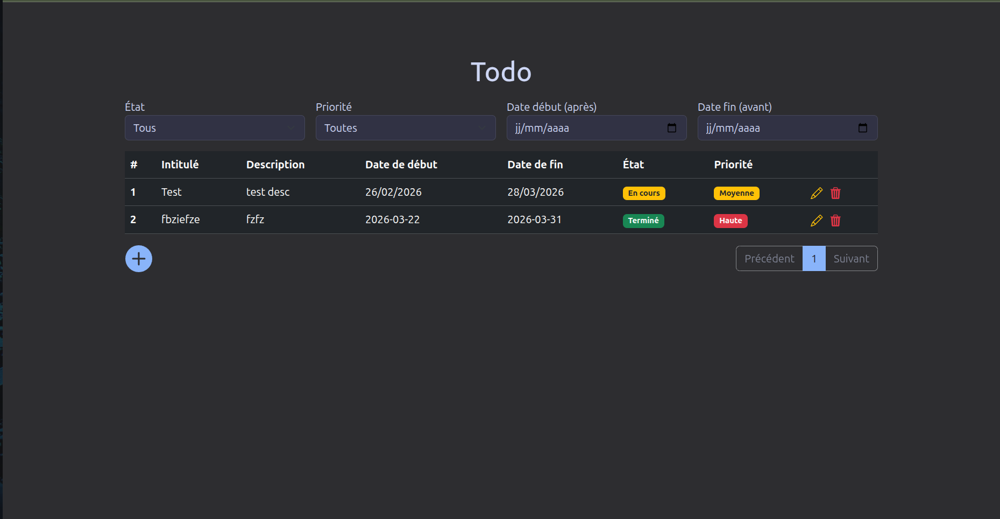
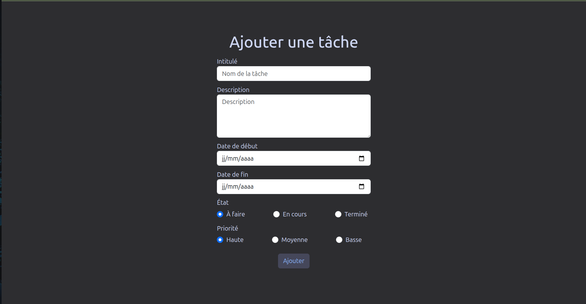
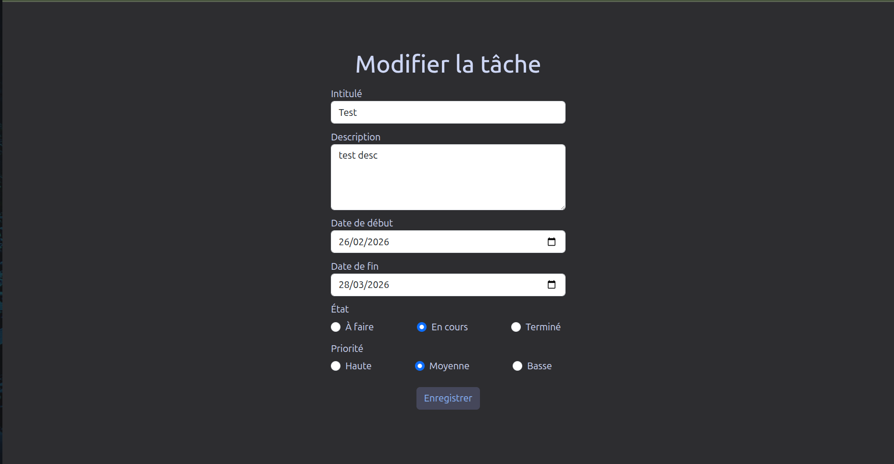

# ToDo App

Une application de gestion de tâches simple et efficace pour organiser votre quotidien.

## Table des matières

- [Aperçu](#aperçu)
- [Installation](#installation)
- [Lancement](#lancement)
- [Fonctionnalités](#fonctionnalités)
- [Structure du projet](#structure-du-projet)
- [Captures d'écran](#captures-décran)

## Aperçu

Cette application permet de gérer vos tâches avec différentes priorités et statuts, de les filtrer et de les paginer. Les données sont persistées dans le navigateur via localStorage.

## Installation

Installez les dépendances :

```bash
npm install
```

## Lancement

Démarrez le serveur de développement :

```bash
npm run dev
```

L'application sera accessible à l'adresse `http://localhost:5173`.

## Fonctionnalités

### Gestion des tâches

- **Ajouter** des tâches avec titre, description, priorité et dates
- **Modifier** les tâches existantes
- **Supprimer** des tâches
- **Marquer** une tâche comme terminée

### Filtrage et tri

- Filtrer par **état** : À faire, En cours, Terminé
- Filtrer par **priorité** : Haute, Moyenne, Basse
- Filtrer par **date de début** et **date de fin**
- **Pagination** des résultats

### Persistance

- Les données sont automatiquement sauvegardées dans le **localStorage** du navigateur

## Structure du projet

```
ToDo/
├── public/              # Ressources statiques
├── src/                 # Code source
│   ├── components/      # Composants React
│   ├── App.tsx          # Composant principal
│   └── main.tsx         # Point d'entrée
├── index.html           # Point d'entrée HTML
├── package.json         # Dépendances et scripts
├── vite.config.ts       # Configuration Vite
└── tsconfig*.json       # Configuration TypeScript
```

## Captures d'écran

### Page principale



### Formulaire d'ajout



### Formulaire de modification


